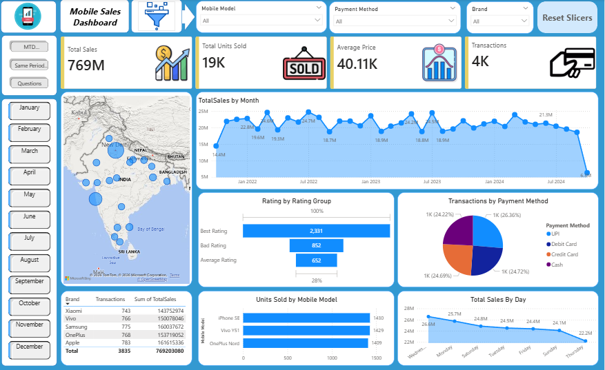

# Mobile Sales Performance Dashboard (Power BI)

## Project Overview
This project presents an interactive Power BI dashboard for analyzing mobile sales performance using a mock dataset.
It focuses on tracking sales, units sold, transactions, and average price across time, brand, city, and payment method to support management and business analysis.

## Business Questions
- How are total sales and units sold trending over time?
- Which brands and mobile models contribute most to sales?
- Which cities drive the highest sales volume?
- Which payment methods are most used by customers?
- How does current performance compare to the same period last year?

## KPIs & Metrics
- Total Sales
- Total Units Sold
- Transactions
- Average Price

## Key Insights
- Sales performance can be compared across periods, including MTD and Same Period Last Year views.
- Brand, city, and payment method breakdowns provide clear visibility into demand drivers.
- Trends and distribution visuals support management decisions and performance tracking.

## Data & Tools Used
- Data Source: Mock dataset (Excel)
- Dataset File: `Mobile Sales Data.xlsx`
- Tooling: Microsoft Power BI
- Report File: `MobileSalesData.pbix`

## Notes on DAX / Time Intelligence
Time Intelligence views are included (MTD and Same Period Last Year) to enable period-over-period comparisons.

## Dashboard Screenshots
Home Dashboard

MTD Dashboard

Same Period Last Year (SPLY)

## Audience
- Managers
- Business Analysts
